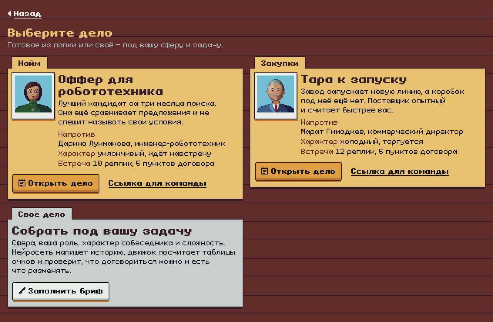
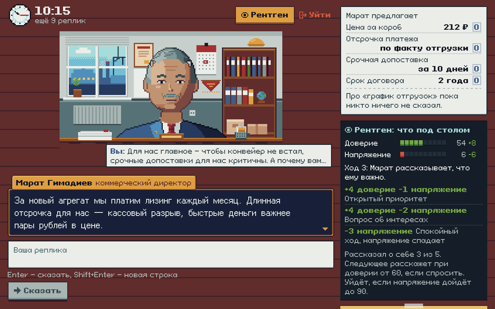
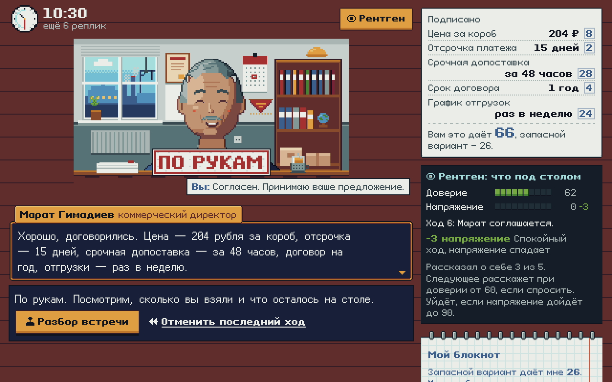
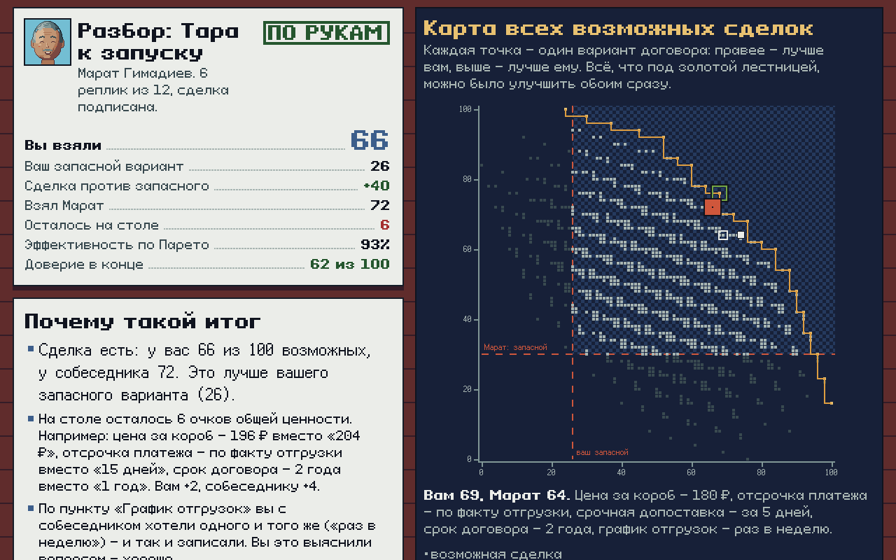

# Переговорка

Пиксельная игра, где вы ведёте деловые переговоры с персонажем, а после встречи смотрите разбор: сколько взяли и где можно было взять больше. Для сотрудников, которым надо потренироваться в закупках или найме, не рискуя настоящей сделкой. Кейс №9 ОЭЗ «Алабуга», ЛЦТ 2026.



## Как попробовать

Демо: ссылка появится до 29.09.

Локально нужен Node.js 22:

```sh
npm ci
npm run dev        # игра на http://localhost:5173, API на :8787
```

Ключи не обязательны. Без `.env` игра запускается в офлайн-режиме: реплики игрока разбирают правила, оппонент отвечает заготовками. С нейросетью скопируйте `.env.example` в `.env` и заполните:

```sh
LLM_PROVIDER=yandex
YANDEX_API_KEY=...
YANDEX_FOLDER_ID=...
```

Если ключ неверный или модель не ответила за `LLM_TIMEOUT_MS`, ход доигрывается офлайн, игра при этом не останавливается.

С тем же `YANDEX_API_KEY` включается голос (Yandex SpeechKit): кнопка «Голос» в шапке встречи озвучивает собеседника, кнопка с микрофоном рядом со «Сказать» переводит речь в текст. Распознанное попадает в поле ввода, его можно поправить перед отправкой. Без ключа, без сервера или при сбое SpeechKit кнопок голоса нет или звук просто не играет.

Прод: `npm run build && npm start` поднимает один процесс, который отдаёт и фронт, и `/api`. То же самое собрано в `Dockerfile`.

## Как устроена игра

1. **Дело.** Выберите одно из двух готовых («Тара к запуску» — закупки, «Оффер для робототехника» — найм) или соберите своё: сфера, ваша роль, характер собеседника, сложность, цели. Кнопка «Ссылка для команды» даёт адрес, по которому у всех будут одинаковые условия. Чтобы собрать результаты на одной доске, откройте тренировку через кабинет руководителя (ниже).
2. **Встреча.** В договоре пять пунктов. Вы видите только свою таблицу очков, у собеседника своя. Пункты бывают трёх видов:
   - делимые: цена или оклад, что одному плюс, другому минус;
   - разменные: одной стороне пункт важен, другой почти безразличен, и на них создаётся ценность;
   - совместимые: обе стороны хотят одного и того же, но об этом не знают.

   Пишете свободным текстом, формальное предложение можно положить через блокнот. На встречу даётся 10–12 реплик. Кнопка «Рентген» показывает доверие и напряжение собеседника и то, из-за какой реплики они изменились.
3. **Разбор.** Итог, карта всех возможных сделок, таблица собеседника, три ключевых момента с цитатами. С любого из этих моментов встречу можно переиграть.



## Для компании: тренировка команды

На титуле и в папке дел есть вход «Для руководителя». Сценарий такой:

1. Руководитель (тренер, HR) выбирает дело из папки или собирает своё и называет тренировку, например «Отдел закупок, октябрь».
2. Получает две ссылки. Ссылку для команды отправляет в рабочий чат. Вторая ссылка, на доску результатов, остаётся у него.
3. Участник открывает ссылку, вписывает имя или ник и играет. После разбора результат сам уходит в журнал тренировки. Переигрывать можно, на доске хранятся первая, лучшая и последняя попытки.
4. На доске видно ведомость с сортировкой (очки против запасного, Парето, доверие, финал, звёзды, время, попытки), чем кончилось у команды по восьми финалам, средний профиль поведения против эталона Rackham и типичные ошибки: слабые привычки, которые повторяются у нескольких человек, и сколько человек не нашли общий интерес. Выгрузка в CSV для Excel. Доска обновляется кнопкой.

Итог попытки сервер пересчитывает сам из истории ходов тем же движком, поэтому у всех одна мерка и результаты сравнимы. Комната — файл в `CACHE_DIR/rooms`, перезапуск сервера она переживает.

Ограничения MVP: аккаунтов нет, доступ к доске даёт секрет в ссылке. Кто получил ссылку на доску, видит результаты всех, а потерянную ссылку не восстановить, придётся открыть новую тренировку (с того же браузера открытые тренировки видны в кабинете). Участник подписывается как хочет, имя никто не проверяет. В комнате до 200 участников. Без сервера (офлайн-режим в браузере) кабинет и доска не работают и говорят об этом.

Решения принимает движок. Нейросеть на каждом ходу делает две отдельные вещи:

- **размечает реплику игрока**: какие приёмы в ней есть (к каждому цитата), какое предложение сделано, не нарушен ли деловой тон. Температура 0, строгий JSON, ответ кэшируется;
- **озвучивает решение движка** в характере персонажа. Если реплика противоречит решению (например, в ней согласие, которого движок не давал), её выбрасываем и берём шаблон.

Движок детерминированный. Он двигает доверие и напряжение по найденным приёмам и выбирает: принять, сделать встречное предложение, рассказать о своём интересе (если доверия хватает и игрок спросил), держать позицию, сделать замечание о тоне или уйти. Уступает оппонент по кривой Faratin: на лёгкой сложности быстро, на тяжёлой держится до конца. Ниже своей альтернативы не опускается никогда. Раз одна и та же история ходов всегда даёт один и тот же итог, работает перемотка.



## Как считаем результат

Итог считает движок по трём счетам, модель в оценку не вмешивается.

1. **Сделка.** Ваши очки против вашей альтернативы (BATNA), эффективность по Парето и сколько ценности осталось на столе. Всё это считается по обеим скрытым таблицам. Если сделка хуже, чем просто уйти, это провал, даже когда все улыбались.
2. **Отношения.** С каким доверием собеседник уходит со встречи, сколько раз был нарушен тон и сколько своих интересов он успел рассказать.
3. **Поведение.** 16 наблюдаемых приёмов сравниваем с эталоном Rackham & Carlisle (1978), где сильных переговорщиков сравнивали со средними: вопросы об интересах, проверка понимания, размен «если… то…», раздражители, ультиматумы и так далее.



Откуда взяты индикаторы, веса и пороги, как проверяются сценарии и чего мы не знаем, описано в [docs/research/method.md](docs/research/method.md). Там же ссылки на исследования и разбор игр-референсов. Короткая версия есть в самой игре под заголовком «Как мы считаем».

## Архитектура

```
браузер (React)                 сервер (Hono, Node)
  экраны, рентген,   ── /api ──▶  /api/turn:  разметка реплики ─┐
  карта сделок                                                  ├─▶ движок (src/engine)
                                               озвучка решения ◀┘     детерминированный TS
                                  /api/report, /api/scenarios, /api/rooms,
                                  /api/scenario/generate,
                                  /api/tts, /api/stt ── Yandex SpeechKit
                                        │
                                  LLM-провайдер: yandex | anthropic | openai | claude-cli | offline
                                  кэш ответов на диске (CACHE_DIR, ключ — хэш входа)
```

- Движок (`src/engine`) — чистый TypeScript без случайности: таблицы очков, стратегия уступок, доверие и напряжение, отчёт. Там же офлайн-разметчик на правилах и шаблонные реплики.
- Сервер (`src/server`) — Hono. Выбирает провайдера по `LLM_PROVIDER`, и если провайдер не поднялся, откатывается в `offline`.
- Своё дело. Нейросеть пишет историю, людей и варианты, а таблицы очков и BATNA строит движок. Потом он проверяет, что зона соглашения есть и размен выгоднее, чем делить всё пополам. Если проверка не прошла, модели дают ещё две попытки с замечаниями, после этого подбирается дело из библиотеки. В офлайн-режиме своё дело сразу подбирается из библиотеки.
- Кэш. Одинаковый ход даёт тот же ответ даже после перезапуска, если `CACHE_DIR` лежит на постоянном диске.
- Голос. Озвучка — SpeechKit v1, mp3, кэш в `CACHE_DIR/tts`. Голос по полу персонажа: Филипп или Алёна (у них самая живая интонация среди голосов v1), эмоция движка меняет темп, а у Алёны «довольный» включает роль `good`. Печать реплики подстраивается под длину звука. Запись с микрофона браузер сам перегоняет в 16 кГц моно PCM (так одинаково работают webm из Chrome и mp4 из Safari) и отправляет на синхронное распознавание, до 30 секунд. Лимиты на IP в сутки — в памяти процесса.

## Что есть в MVP и чего нет

Есть: два проверенных дела и генерация своего, свободный текст или голос плюс блокнот с формальным предложением, озвучка собеседника, пять характеров и три уровня сложности, контроль делового тона, рентген, отмена хода, разбор с картой сделок и перемоткой, ссылка для команды, кабинет руководителя с доской результатов, офлайн-режим, вёрстка под телефон.

Нет: аккаунтов (доступ к доске по секретной ссылке), многопользовательских переговоров между людьми.

## Стек и внешние сервисы

- React 19, Vite, TypeScript. Графика нарисована кодом по сетке в палитре Apollo, шрифты Ark Pixel и Pixeloid под OFL (подробнее в [docs/art.md](docs/art.md)).
- Hono на Node 22, zod для проверки ответов модели. Тесты на vitest, линтер oxlint.
- **YandexGPT 5.1** через OpenAI-совместимый эндпоинт Yandex Cloud. Взяли её, потому что она доступна из России и оплачивается в рублях. Ключ получают так: в консоли Yandex Cloud создать сервисный аккаунт с ролью `ai.languageModels.user`, выпустить ему API-ключ и взять ID каталога.
- **Yandex SpeechKit** для голоса, тот же ключ. Сервисному аккаунту нужны роли `ai.speechkit-tts.user` и `ai.speechkit-stt.user` (или общая `ai.editor`). Если распознаванию роли не хватает, сервер сам выключает микрофон до перезапуска.

Переменные окружения (полный список в `.env.example`):

| Переменная | Зачем |
|---|---|
| `LLM_PROVIDER` | `yandex`, `anthropic`, `openai`, `claude-cli` или `offline` (по умолчанию) |
| `YANDEX_API_KEY`, `YANDEX_FOLDER_ID`, `YANDEX_MODEL` | YandexGPT |
| `ANTHROPIC_API_KEY`, `OPENAI_API_KEY`, `OPENAI_BASE_URL` | запасные провайдеры |
| `PORT` | порт сервера, 8787 по умолчанию |
| `LLM_TIMEOUT_MS` | через сколько бросать модель и уходить в офлайн, 25000 |
| `CACHE_DIR` | где хранить кэш ответов, озвучку, сгенерированные дела и комнаты тренировок, `.cache` |
| `SPEECH` | `off` — выключить голос, даже если ключ есть |
| `TTS_IP_DAY_LIMIT`, `STT_IP_DAY_LIMIT`, `SPEECH_DAY_LIMIT` | лимиты голоса в сутки: на IP (400 фраз озвучки, 150 распознаваний) и на весь сервер (5000) |

Проверки: `npm test` (движок, сервер, сценарии), `npx tsx scripts/check-scenarios.ts` (проверяет, что в каждом деле есть что разменять), `npx tsx scripts/voice-check.ts` при запущенном `npm run dev` (голос вживую: фраза проходит TTS → STT по кругу, запись с микрофона в браузере, снимки кнопок), `npx tsx scripts/board-e2e.ts` (руководитель открывает тренировку, трое играют по ссылке, доска показывает всех).

## Структура

```
src/engine/            движок, разметка приёмов, офлайн-режим, отчёт
src/server/            API, провайдеры LLM, генерация дел, кэш
src/game/              экраны и пиксельный UI-кит (/?showcase)
src/content/scenarios/ готовые дела и их проверка
docs/                  методика и описание графики
tools/art/             скрипты, которые рисуют портреты, сцены и рамки
scripts/               проверка сценариев, прогоны и e2e
```

## Команда

«Би 2 Би».
